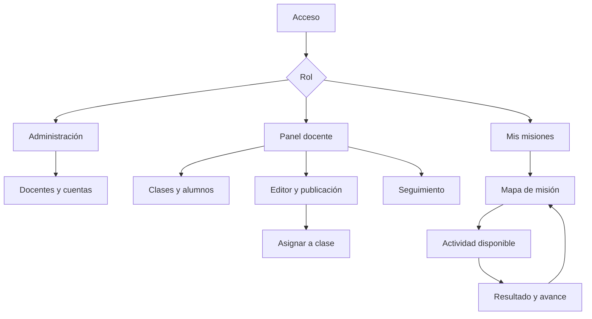

# EduQuest — Plan maestro del proyecto DAW

Autor: David García. Nombre de trabajo, pendiente de elección definitiva y de comprobar disponibilidad si se publica. Fecha: 16 de septiembre de 2026. Estado: propuesta; no hay aplicación implementada ni aprobación del centro registrada.

Este documento define una aplicación web educativa y una forma de construirla con Codex por entregas reales. La propuesta académica adjunta se apoya en la plantilla facilitada. Las fechas, horas oficiales, tecnologías obligatorias y normas sobre herramientas de IA se incorporarán cuando el centro las comunique.

## 1. Decisión de producto

EduQuest permitirá a un docente convertir un repaso en una misión visual. Creará una secuencia de actividades, la asignará a una clase y verá el avance individual. Un alumno entrará en su cuenta, abrirá el mapa y desbloqueará etapas al completar las anteriores. Podrá cerrar sesión y continuar después.

La inspiración es la experiencia de las antiguas misiones de Classcraft. Se desarrollarán código, textos, identidad y recursos propios. La propuesta no requiere recuperar datos ni acceder al servicio antiguo. Se hablará de aquellas misiones como antecedente: actualmente existe una oferta de HMH con la marca Classcraft, por lo que no conviene afirmar sin matices que toda la marca ha desaparecido.

Ejemplo demostrable: «Rescate en el planeta de las fracciones», una misión de cinco nodos: explicación, vídeo seleccionado por el profesor, tarjetas de repaso, cuestionario y explicación final. El docente elegirá curso, asignatura y dificultad. El MVP se demostrará con contenido sintético de Primaria, aunque el modelo admite otros niveles.

El objetivo verificable es facilitar creación, práctica y seguimiento. Una mejora del aprendizaje o de la motivación sería una hipótesis que necesitaría evaluación con alumnado, no un resultado que podamos dar por demostrado con una demo.

## 2. Alcance comprometido

### Incluido en la entrega final

1. Inicio y cierre de sesión, contraseñas protegidas, perfiles y tres roles.
2. Alta de docentes por administrador; alta de alumnos por el docente dentro de sus clases.
3. Clases con un profesor propietario, alumnos y matrículas.
4. Misiones propias con título, contexto narrativo, asignatura, nivel y estado.
5. Editor por formularios: añadir, editar, eliminar y ordenar nodos en borrador.
6. Cuatro tipos de nodo: explicación, vídeo, cuestionario y conjunto de flashcards.
7. Publicación, vista previa, duplicación y archivo de misiones.
8. Asignación de una misión a una o varias clases propias.
9. Mapa secuencial con nodos bloqueados, disponibles y completados; alternativa accesible en lista.
10. Corrección del cuestionario en servidor, reintentos, progreso persistente y puntos personales.
11. Panel docente con avance, intentos y mejores resultados de cada alumno.
12. Generación de borradores con IA, revisión docente y edición antes de publicar.
13. Pruebas de permisos y reglas del dominio, instalación reproducible y demo.

### Ampliaciones fuera del MVP

Ramificaciones y condiciones combinadas, editor libre con arrastrar nodos, multijugador, combate, economía virtual, tienda, rankings públicos, chat, familias, notificaciones push, aplicación móvil nativa, suscripciones, múltiples centros con facturación, marketplace, importación SCORM y tutor conversacional para alumnos. Tampoco se incluyen subida/transcodificación de vídeo ni búsqueda automática de vídeos con IA.

Estos recortes protegen el objetivo principal. Se mantiene la apariencia de mapa y la progresión, sin programar un motor de videojuegos.

## 3. Usuarios y permisos

| Acción | Administrador | Docente | Alumno |
|---|---|---|---|
| Crear o desactivar docentes | Sí | No | No |
| Crear clases | No en el MVP | Propias | No |
| Crear cuentas de alumnos | No en el MVP | En sus clases | No |
| Crear y publicar misiones | No en el MVP | Propias | No |
| Generar contenido con IA | No | Para sus misiones | No |
| Asignar misiones | No | A clases propias | No |
| Consultar progreso | No por defecto | De sus alumnos y asignaciones | Solo el suyo |
| Completar actividades | No | Solo vista previa sin progreso | Solo asignadas y desbloqueadas |

Modelo deliberadamente simple: un rol por usuario, un docente propietario por clase y por misión. Un alumno puede pertenecer a varias clases; en el MVP su cuenta la gestiona el docente que la creó. No se añade codocencia todavía. La autorización se comprobará en cada petición del servidor, también para consultar objetos por identificador.

### Cuentas

- Registro público deshabilitado. El administrador inicial se crea con un comando de instalación, sin contraseña fija en el repositorio.
- Docentes: nombre, email único, usuario único, contraseña y estado activo. Restablecimiento mediante correo con token temporal.
- Alumnos: alias, usuario único y contraseña temporal; email no obligatorio. El docente entrega credenciales y el alumno cambia la contraseña al entrar por primera vez.
- El docente puede regenerar la contraseña de los alumnos que creó; la acción invalida sesiones anteriores. No puede ver contraseñas existentes.
- Cambiar la propia contraseña requiere la contraseña actual. Desactivar una cuenta bloquea nuevas peticiones, aunque mantenga una sesión abierta.
- Datos de demostración ficticios. Una instalación real en un colegio requerirá concretar su gestión de datos antes de introducir información de menores.

## 4. Reglas que deben cerrarse antes de programar

### Misiones y asignaciones

- Estados: borrador, publicada y archivada.
- Publicar exige al menos un nodo y que todos los nodos pasen su validación de contenido.
- Solo los borradores se editan. Una misión publicada se duplica para modificarla; conserva intactos los intentos y resultados ya generados.
- Una asignación une una misión publicada y una clase propia. No permite duplicar esa pareja. Solo puede retirarse si no tiene actividad; si tiene actividad se cierra y conserva resultados.
- Archivar una misión impide nuevas asignaciones. Las asignaciones existentes conservan acceso mientras sigan abiertas.
- Al matricular a un alumno se crean sus inscripciones en las asignaciones abiertas de la clase. Al desmatricularlo se desactivan, preservando su historial. Reingresar reactiva la inscripción previa.
- La vista previa docente no genera progreso ni puntos de alumnos.

### Finalización de nodos

| Tipo | Contenido | Condición de finalización |
|---|---|---|
| Explicación | Título y texto con formato limitado | Confirmar lectura |
| Vídeo | Identificador o URL validada del proveedor permitido | Confirmar revisión del recurso |
| Cuestionario | Preguntas de respuesta única con opciones y explicación | Alcanzar el umbral, por defecto 70 % |
| Flashcards | Pares de anverso y reverso | Revisar todas las tarjetas y confirmar repaso |

Confirmar lectura, vídeo o tarjetas indica una acción del alumno; no demuestra comprensión ni visionado real. El cuestionario aporta una comprobación de respuestas. Para los vídeos se ofrecerá enlace alternativo cuando no se puedan reproducir incrustados.

El orden será lineal. El primer nodo estará disponible; los demás requerirán completar el inmediatamente anterior. Se podrá volver a leer cualquier nodo completado. El servidor comprobará matrícula, asignación abierta y requisito previo tanto al abrir un nodo como al enviar su finalización. No enviará el contenido de nodos bloqueados al navegador, solo los datos necesarios para dibujar el mapa.

### Cuestionarios, progreso y puntos

- Entre 1 y 10 preguntas por cuestionario, entre 2 y 4 opciones por pregunta y exactamente una correcta.
- Umbral entre 1 y 100 %, con 70 % por defecto. Nota = aciertos / preguntas × 100. Comparar el valor sin redondear con el umbral; redondear solo para mostrar.
- Reintentos ilimitados con un breve límite de frecuencia. Guardar cada intento y la mejor nota. Un fallo posterior no revoca una superación anterior.
- El servidor calcula nota y condición de superación; no acepta del navegador la nota final ni los puntos.
- Los datos previos al envío excluyen indicadores de respuesta correcta. El feedback posterior puede explicar las respuestas; es una actividad de repaso, no un examen de alta seguridad.
- Progreso = nodos completados / nodos de la misión × 100, separado de la nota del cuestionario.
- Diez puntos por nodo completado, una sola vez por inscripción y nodo. No hay puntos extra por reintentar ni clasificaciones públicas.
- Finalizar debe ser idempotente: dos clics o dos peticiones concurrentes producen una sola finalización. Transacción, restricción única y bloqueo cuando sea necesario.
- Guardar al terminar cada nodo; el MVP no guarda borradores de respuestas a mitad de un cuestionario. Se explicará este límite en la interfaz.

## 5. Tecnologías elegidas

| Capa | Elección | Función en este proyecto |
|---|---|---|
| Servidor | PHP 8.4 y Laravel 13 | Rutas, reglas, validación, permisos y persistencia |
| Interfaz | Vue 3 con Composition API y TypeScript | Formularios, mapa, tarjetas y cuestionarios |
| Unión cliente-servidor | Inertia, versión compatible del starter oficial | Navegación Vue desde controladores Laravel |
| Estilo | Tailwind CSS y shadcn-vue del starter | Componentes consistentes y diseño adaptable |
| Recursos frontend | Vite, npm y Node LTS compatible al instalar | Desarrollo y compilación de la interfaz |
| Base de datos | MySQL 8.4 LTS | Usuarios, relaciones, actividades y resultados |
| Acceso a datos | Eloquent, migrations, factories y seeders | Modelo persistente, esquema y datos de prueba |
| Autenticación | Starter oficial con Fortify y sesiones | Base de acceso; adaptar login por usuario y altas controladas |
| Autorización | Policies de Laravel | Permisos por rol, propietario y matrícula |
| IA | Servicio Laravel que llama a una API de texto | Generar JSON validado; proveedor configurable |
| Pruebas servidor | Pest | Reglas, permisos, validación, base de datos y endpoints |
| Pruebas navegador | Playwright | Recorridos críticos profesor-alumno |
| Calidad | Laravel Pint, ESLint, TypeScript y Prettier | Consistencia y errores detectables automáticamente |
| Entorno | VS Code, Codex y Git | Desarrollo asistido y evidencias de evolución |
| Ejecución local | Docker Compose con PHP, Nginx, MySQL y Mailpit | Entorno reproducible y correo de pruebas |
| Entrega | Contenedores en un servidor Linux con HTTPS | Aplicación web funcional y base persistente |

Laravel 13 admite PHP 8.3–8.5 según su documentación. Se propone PHP 8.4 y se fijarán dependencias efectivas en composer.lock y package-lock.json al arrancar. No se actualizarán versiones mayores en mitad de una entrega. El starter oficial Vue integra TypeScript, Tailwind y shadcn-vue; sus versiones compatibles se mantendrán juntas.

Arquitectura: monolito modular. Un único repositorio, una aplicación Laravel, vistas Vue en resources/js y una base de datos. Se atiende todo bajo el mismo origen. Inertia no exige una API REST independiente. Usaremos sesiones con cookies y protección CSRF; no hacen falta JWT, microservicios, Redis o una app móvil para este alcance.

El despliegue necesita ejecutar PHP y disponer de base de datos persistente; publicar solo los archivos de Vite en un hosting estático no basta. El proveedor se elegirá cuando conozcamos presupuesto y requisitos de entrega. No se presupone alojamiento gratuito permanente.

En el PC local se comprobarán primero PHP, Composer, Node, Git y Docker. Si Docker Desktop está disponible y funciona, se usará Compose. Si no, se preparará un entorno nativo equivalente. No se presupone compatible ninguna instalación existente sin comprobarla.

## 6. Estructura prevista del código

Rutas en routes/web.php. Controladores delgados separados por áreas Admin, Teacher y Student. Form Requests para validar entradas. Policies para autorizar modelos. Eloquent para persistencia. Services para PublishingService, ProgressService, QuizGradingService y MissionDraftGenerator. Jobs solo para generación de IA en segundo plano, con cola en base de datos.

Vistas en resources/js/pages; componentes reutilizables en resources/js/components. El mapa, el reproductor de actividad y el editor tienen componentes separados. No se añade Pinia ni Vue Router salvo que surja una necesidad concreta: Inertia ya gestiona la navegación y los datos de página.

Carpeta docs con propuesta, RFTP, casos de uso, decisiones, memoria por secciones, evidencias por hito y registro de horas. README con instalación, variables, migraciones, seed de demo, pruebas y arranque.

## 7. Modelo de datos inicial

Los nombres son una base de diseño, pendiente de convertir en migraciones en la fase autorizada.

| Tabla | Campos principales | Relaciones y restricciones |
|---|---|---|
| users | id, name, username, email nullable, password, role, active, must_change_password, created_by | username único; email único si existe; created_by al docente o administrador creador |
| classrooms | id, teacher_id, name, level, subject, archived_at | Propietario docente |
| classroom_memberships | id, classroom_id, student_id, active | Pareja clase-alumno única |
| missions | id, teacher_id, title, description, subject, level, status, source, published_at | Propietario docente; source manual/ai |
| mission_nodes | id, mission_id, position, type, title, body, video_provider, video_id, pass_threshold | Pareja misión-posición única; validar campos según tipo |
| quiz_questions | id, node_id, position, statement, explanation | Nodo de tipo quiz |
| quiz_options | id, question_id, position, text, is_correct | Validación de exactamente una correcta por pregunta |
| flashcards | id, node_id, position, front, back | Nodo de tipo flashcards |
| mission_assignments | id, mission_id, classroom_id, status, assigned_at | Pareja misión-clase única |
| mission_enrollments | id, assignment_id, student_id, active, completed_at | Pareja asignación-alumno única |
| node_progress | id, enrollment_id, node_id, completed_at, points_awarded | Pareja inscripción-nodo única; estado disponible/bloqueado se deriva |
| quiz_attempts | id, enrollment_id, node_id, score, passed, submitted_at | Historial inmutable de entregas |
| quiz_answers | id, attempt_id, question_id, option_id, is_correct | Una respuesta por pregunta e intento; opción debe pertenecer a la pregunta |
| ai_generations | id, teacher_id, status, input_summary, output_json, error_code, mission_id, created_at | Solo su propietario; no almacenar datos personales del alumnado |

Además, tablas técnicas del framework: sesiones, tokens de recuperación y cola de trabajos. Para las flashcards, el formulario enviará los identificadores revisados; el servidor validará que pertenecen al nodo y están todos presentes. Ese registro sirve para comprobar el flujo, no para acreditar que el alumno leyó de verdad.

Usar claves foráneas e índices. No eliminar en cascada usuarios o misiones que tengan evidencias de actividad: desactivar o archivar. En borradores sin actividad sí se puede eliminar su contenido. Verificar dentro de una transacción las relaciones inscripción-asignación-misión-nodo para evitar que se mezclen identificadores válidos de contextos distintos.

## 8. Navegación e interfaz



Pantallas mínimas: acceso, cambio/recuperación de contraseña, administración de docentes, panel docente, clases, alumnos de una clase, listado de misiones, editor, generación asistida, vista previa, asignación, seguimiento, misiones del alumno, mapa, actividad y resultado. Explicación, vídeo, quiz y tarjetas comparten un contenedor de actividad con controles específicos.

Dirección visual: aventura limpia y legible, apropiada para Primaria y adaptable a Secundaria. Panel docente sobrio; experiencia del alumno más visual. Fondo marfil #F8FAFC, texto #0F172A, primario azul #2563EB y acentos verdes. Los colores son una propuesta: verificar contraste en los componentes reales. Recursos propios o con licencia documentada.

En escritorio, mapa con camino y nodos numerados; en móvil, recorrido vertical. Los nodos serán botones reales, con icono y texto de estado. Ofrecer vista en lista, foco visible, navegación por teclado, mensajes de error junto a los campos y opción de reducir animaciones. No depender únicamente del color ni del gesto de arrastrar para ordenar.

El editor tendrá campos generales, lista ordenada de nodos y formulario del nodo seleccionado. Botones subir/bajar resuelven la ordenación inicial. La vista previa permite probar antes de publicar. Nunca mostrar como guardado un cambio cuyo envío ha fallado.

## 9. Generación con IA

Entrada: tema, nivel educativo, objetivo de repaso, dificultad, número de nodos y, opcionalmente, texto de referencia pegado por el docente. Límites iniciales: 4–8 nodos, hasta 10 preguntas por quiz y hasta 10 tarjetas por conjunto. El límite de longitud del texto se fijará al elegir proveedor y presupuesto.

Flujo: solicitar → comprobar cuota → crear trabajo → llamar al proveedor desde el servidor → validar estructura y contenido básico → guardar borrador → revisar y editar → publicar manualmente. El alumno no accede a la API ni a un chat.

La salida se ajustará a un esquema JSON con título, narrativa y nodos. Validar tipos, límites, opciones, una respuesta correcta y umbral. Si faltan datos o hay JSON inválido, mostrar error recuperable y conservar la petición; no publicar ni guardar una misión incompleta como válida. Texto del usuario y respuesta del modelo se tratan como datos no confiables.

El vídeo lo elige el docente. La IA puede sugerir términos de búsqueda y crear un nodo pendiente, pero no se le permite inventar un enlace. El borrador no se podrá publicar hasta completar o eliminar ese nodo.

Llave API en variables de entorno del servidor, nunca en variables VITE ni en Git. Una petición activa por docente, cuota configurable, timeout y control de reintentos. Guardar consumo reportado por el proveedor cuando exista; sin afirmar un coste hasta conocer modelo y tarifa. Si falla la IA, la creación manual sigue disponible.

Definir interfaz MissionDraftGenerator con implementación real y fake para pruebas. El fake estará identificado como simulación y jamás se usará como evidencia de que la integración externa funciona. Para la entrega con IA se demostrará al menos una llamada real con su gestión de errores. El proveedor concreto se decidirá en esa fase.

## 10. Seguridad y fiabilidad comprobables

- Autenticación del framework, hash de contraseñas, regeneración de sesión y limitación de intentos.
- CSRF en operaciones de escritura, cookies seguras en despliegue y HTTPS.
- Policies por propiedad y matrícula en servidor; filtros del frontend solo como ayuda visual.
- Validación de todas las entradas y asignación explícita de campos. Impedir que el usuario cambie su rol manipulando formularios.
- Evitar HTML arbitrario y bloques iframe pegados. Texto limitado con escapado seguro; vídeos construidos desde identificadores validados de proveedores permitidos.
- No descargar desde el servidor cualquier URL de vídeo suministrada. No hace falta para incrustar un recurso.
- Transacciones y unicidad para progreso y puntos. Pruebas de envío repetido.
- Resultados y respuestas correctas excluidos de las propiedades enviadas al alumno antes de responder.
- Secretos fuera de Git, logs sin contraseñas ni credenciales y datos de demo ficticios.
- Copia y restauración de MySQL documentadas; comprobar una restauración en un entorno de pruebas antes de la entrega.

No se presentará una lista de medidas como certificación de seguridad. Cada afirmación de la memoria deberá corresponder a algo implementado y, cuando proceda, probado.

## 11. RFTP y trazabilidad

El Word contiene R01–R08 y su RFTP inicial. Los identificadores siguen la plantilla: R01F01T01P01 identifica una prueba de la primera tarea de una función. Los R son requisitos en lenguaje natural; las F describen funciones; las T delimitan trabajo; las P definen evidencia verificable.

### R01 Solo deben acceder personas autorizadas y cada una debe tener los permisos de su perfil.

- **R01F01** Gestionar credenciales y cuentas.
- **R01F01T01** Adaptar acceso por usuario, altas controladas, cambio y recuperación de contraseña, desactivación y cierre de sesión.
- **R01F01T01P01** Probar acceso válido e inválido, recuperación docente y bloqueo de una cuenta desactivada con sesión previa. Estado: planificada.

- **R01F02** Aplicar roles y propiedad.
- **R01F02T01** Crear Policies y validación de campos para impedir elevación de rol y acceso a recursos ajenos.
- **R01F02T01P01** Comprobar que un alumno no entra en docencia y que un docente no modifica una clase ajena. Estado: planificada.

### R02 El profesor debe organizar a sus alumnos en clases.

- **R02F01** Gestionar clases y alumnos.
- **R02F01T01** Crear formularios y relaciones para clases propias, cuentas de alumnos y matrículas activas.
- **R02F01T01P01** Crear dos clases con propietarios distintos y verificar separación de sus alumnos. Estado: planificada.

- **R02F02** Gestionar altas y bajas.
- **R02F02T01** Sincronizar matrículas con inscripciones en asignaciones abiertas, conservando historial al desactivar.
- **R02F02T01P01** Comprobar que una baja bloquea el acceso y que una reincorporación conserva el avance previo. Estado: planificada.

### R03 El profesor debe poder preparar y distribuir una misión.

- **R03F01** Editar y validar borradores.
- **R03F01T01** Crear editor de misión y ordenación de nodos; validar contenido antes de publicar.
- **R03F01T01P01** Guardar, reabrir y reordenar un borrador; rechazar publicación con nodos incompletos. Estado: planificada.

- **R03F02** Publicar y asignar contenido.
- **R03F02T01** Publicar, duplicar, archivar y asignar misiones a clases propias; impedir edición de publicadas.
- **R03F02T01P01** Asignar a dos clases propias; rechazar una clase ajena y verificar que una copia no altera el original. Estado: planificada.

### R04 El alumno debe realizar actividades de repaso de varios tipos.

- **R04F01** Presentar recursos y tarjetas.
- **R04F01T01** Implementar explicación, vídeo validado con enlace alternativo y flashcards accesibles.
- **R04F01T01P01** Completar cada tipo; comprobar rechazo de vídeo inválido y de tarjetas ajenas al nodo. Estado: planificada.

- **R04F02** Corregir cuestionarios.
- **R04F02T01** Validar preguntas y opciones, corregir en servidor y guardar intentos y mejor nota.
- **R04F02T01P01** Probar 2 de 3 aciertos con umbral del 70 %, respuestas manipuladas y reintento posterior. Estado: planificada.

### R05 El alumno debe avanzar por etapas sin perder lo que ha completado.

- **R05F01** Aplicar los desbloqueos.
- **R05F01T01** Comprobar matrícula, asignación y nodo anterior al consultar o finalizar una actividad.
- **R05F01T01P01** Intentar abrir y completar un nodo bloqueado por URL y petición directa; debe rechazarse. Estado: planificada.

- **R05F02** Persistir progreso y puntos.
- **R05F02T01** Guardar una finalización por inscripción y nodo, con transacción y unicidad; calcular avance.
- **R05F02T01P01** Reenviar y duplicar simultáneamente la finalización; verificar un único premio y persistencia tras nuevo acceso. Estado: planificada.

### R06 El profesor debe conocer el avance de sus alumnos.

- **R06F01** Mostrar seguimiento individual y de clase.
- **R06F01T01** Consultar progreso, intentos y mejor nota filtrando por profesor, clase y asignación.
- **R06F01T01P01** Comparar el panel con resultados de dos alumnos conocidos y denegar datos de otro docente. Estado: planificada.

- **R06F02** Distinguir avance de calificación.
- **R06F02T01** Presentar porcentaje completado, nota y estados con etiquetas y filtros comprensibles.
- **R06F02T01P01** Verificar que un alumno con recursos vistos y quiz pendiente no figura como misión completada. Estado: planificada.

### R07 El profesor debe poder recibir ayuda de IA sin publicar contenido sin revisar.

- **R07F01** Generar un borrador estructurado.
- **R07F01T01** Crear servicio de API, esquema de salida, cuota, timeout y validación del resultado.
- **R07F01T01P01** Probar salida válida, salida inválida, cuota y error del proveedor; demostrar una llamada real. Estado: planificada.

- **R07F02** Revisar antes de publicar.
- **R07F02T01** Convertir la salida válida en borrador editable y exigir completar o retirar vídeos pendientes.
- **R07F02T01P01** Comprobar que generar no publica y que solo el propietario puede revisar y publicar. Estado: planificada.

### R08 El proyecto debe poder instalarse, probarse y explicarse con evidencias.

- **R08F01** Diseñar y documentar la solución.
- **R08F01T01** Mantener RFTP, casos de uso, diagramas, planificación, horas reales y memoria por hitos.
- **R08F01T01P01** Contrastar tareas cerradas con commits y evidencias, y totalizar horas y desviaciones. Estado: planificada.

- **R08F02** Verificar e instalar la aplicación.
- **R08F02T01** Preparar pruebas críticas, interfaz adaptable, README, contenedores, datos de demo y copia/restauración de la BD.
- **R08F02T01P01** Ejecutar pruebas, recorrer la demo con teclado y móvil, instalar desde cero y restaurar una copia. Estado: planificada.

### Registro de tareas y horas

Cada tarea del backlog tendrá: identificador, título, requisito, hito, criterios de aceptación, estimación en horas, horas reales, estado, commit y evidencia. Las pruebas iniciales están planificadas, no ejecutadas. Si se divide una tarea durante el desarrollo, se conservan sus vínculos y se añaden identificadores.

Registro de horas por sesión: fecha real, tarea RFTP, actividad, duración real, resultado, commit/evidencia y bloqueo. Git demuestra cambios; no demuestra por sí solo horas dedicadas. Se registrarán lectura, revisión, depuración y pruebas, también cuando intervenga Codex.

## 12. Fases y entregas académicas

Estimación inicial de trabajo: 200 horas. Es una hipótesis de planificación que debe ajustarse a las horas del módulo y a la disponibilidad real. Los porcentajes son hitos funcionales con evidencias, no un recuento de líneas de código.

| Hito | Horas de referencia acumuladas | Qué debe existir | Evidencia |
|---|---:|---|---|
| Propuesta | 20 | Alcance, tecnologías, RFTP, navegación y planificación | Propuesta y versión documental |
| Feedback 50 % | 100 | Acceso, roles, clases, misión manual con cuatro tipos, asignación y recorrido del alumno | Demo funcional, pruebas básicas, capturas y tag |
| Feedback 80 % | 160 | IA real con revisión, seguimiento, permisos completos y diseño adaptable | Demo ampliada, pruebas críticas y desviaciones |
| Entrega final | 200 | Correcciones, despliegue reproducible, memoria y defensa | Release, manuales, resultados de pruebas y horas reales |

Distribución preliminar por requisito: R01 16 h; R02 12 h; R03 20 h; R04 24 h; R05 24 h; R06 12 h; R07 24 h; R08 68 h. Total 200 h. R08 incluye análisis, diseño, integración, pruebas transversales, documentación, despliegue y defensa. Esta agrupación se desglosará por tareas al calendarizar.

Distribución prevista por fase para que los hitos y el total sean coherentes. En el 50 % existirá el flujo manual básico; el resto de las horas de esos requisitos cerrará controles y casos límite en el 80 %.

| Requisito | Propuesta | Hasta el 50 % | Del 50 al 80 % | Cierre final | Total |
|---|---:|---:|---:|---:|---:|
| R01 | 0 | 12 | 4 | 0 | 16 |
| R02 | 0 | 8 | 4 | 0 | 12 |
| R03 | 0 | 16 | 4 | 0 | 20 |
| R04 | 0 | 20 | 4 | 0 | 24 |
| R05 | 0 | 16 | 8 | 0 | 24 |
| R06 | 0 | 0 | 12 | 0 | 12 |
| R07 | 0 | 0 | 20 | 4 | 24 |
| R08 | 20 | 8 | 4 | 36 | 68 |
| Total por fase | 20 | 80 | 60 | 40 | 200 |

Presupuesto académico ilustrativo: 200 h × 20 €/h = 4.000 € de valoración de trabajo. No es un pago necesario para desarrollar. Reservas orientativas, no tarifas verificadas: 20 € de API, 30 € de alojamiento y 15 € de dominio opcional; techo provisional 4.065 € incluyendo valoración de trabajo. Confirmar costes antes de contratar; la demo local puede evitar alojamiento y dominio. Si cambian horas o precios, recalcular.

No fijar un Gantt con fechas inventadas. Al recibir las fechas: repartir las horas por disponibilidad, añadir dependencias y reservar margen antes de cada entrega. Mantener una planificación inicial y otra real; analizar sus diferencias como pide la plantilla.

### Política de avance

Ahora solo se prepara la propuesta y su documentación. Tras la aprobación académica se activa la fase de construcción hasta el 50 %. Se entrega feedback real, se incorporan correcciones y se autoriza avanzar al 80 %. Después se cierra la versión final. Esta separación responde a la petición del alumno; la plantilla no establece por sí sola fechas ni una obligación de permanecer sin trabajar entre entregas.

No fabricar avances parciales a partir de un producto completo, pruebas supuestamente ejecutadas, horas, capturas históricas ni fechas de commits. Las etiquetas sugeridas son propuesta-v0.1, hito-50, hito-80 y entrega-v1.0, creadas solo cuando correspondan. Todos los estados se anotan según lo que exista realmente.

## 13. Pruebas de aceptación prioritarias

1. Un alumno no entra en rutas docentes; un docente no consulta ni modifica una clase ajena aunque conozca su identificador.
2. Usuario inactivo con sesión previa pierde el acceso.
3. Credenciales y roles no se pueden modificar desde campos no autorizados.
4. Una misión con quiz inválido o vídeo pendiente no se publica.
5. Solo misiones publicadas se asignan a clases propias.
6. Un alumno no matriculado no abre una asignación ni sus resultados.
7. Un nodo bloqueado rechaza apertura y finalización directa; su contenido no aparece en los datos de página.
8. 2/3 respuestas correctas no superan un umbral del 70 %; 7/10 sí lo supera.
9. Manipular la nota en una petición no cambia la corrección del servidor.
10. Reenviar una finalización o hacerlo simultáneamente no duplica puntos.
11. Cerrar sesión y volver conserva nodos completados y mejores notas.
12. Revisar tarjetas de otro nodo no cuenta para finalizar el actual.
13. Un docente no modifica una misión publicada; una copia editable no altera el historial original.
14. IA sin credenciales, con timeout o con salida inválida informa del error y permite seguir creando a mano.
15. El contenido generado permanece en borrador hasta revisión y publicación explícita.
16. Dos docentes de prueba solo ven sus respectivas cuentas, clases, misiones y resultados autorizados.
17. La navegación esencial funciona con teclado y en una pantalla de móvil; no se exige arrastrar ni distinguir solo colores.
18. Una instalación limpia siguiendo el README puede migrar, cargar datos de demo y ejecutar la aplicación; una copia de la BD se restaura correctamente.

Usar pruebas de servidor para invariantes y permisos, y pocos recorridos de extremo a extremo para la experiencia completa. No sustituir las pruebas del servidor por capturas bonitas. Ejecutar también pruebas relevantes contra MySQL para restricciones que podrían comportarse de otra manera en SQLite.

## 14. Casos de uso para desarrollar en la memoria

CU01 Acceder; CU02 Gestionar una clase; CU03 Crear misión manual; CU04 Generar borrador asistido; CU05 Publicar y asignar; CU06 Completar actividad; CU07 Consultar seguimiento; CU08 Administrar cuentas docentes.

Ejemplo CU06. Actor: alumno. Precondiciones: cuenta activa, matrícula activa, asignación abierta y nodo disponible. Entrada: identificador del nodo y respuestas o confirmación según tipo. Flujo: autorizar, validar, corregir si procede, guardar intento, finalizar si cumple condición y devolver avance. Alternativas: nodo bloqueado, respuestas incompletas, nota insuficiente o envío repetido. Postcondición: resultado persistido; el siguiente nodo solo se habilita si corresponde. Tablas: inscripciones, nodos, progreso, intentos y respuestas. Clases: ProgressService y QuizGradingService. Interfaces: mapa, actividad y resultado.

La memoria añadirá para cada caso descripción, precondiciones, postcondiciones, entradas, salidas, tablas, clases e interfaces, como indica la plantilla.

## 15. Correspondencia con la plantilla de memoria

| Apartado de la plantilla | Qué preparar y cuándo |
|---|---|
| Portada | Título definitivo, curso, alumno y tutor; completar al conocer datos |
| Índices | Automáticos de contenido, tablas y figuras en la memoria final |
| Abstract | Español e inglés, una página conjunta; actualizar al resultado real |
| Justificación | Necesidad docente y comparación razonada de alternativas |
| Introducción | Problema, público y recorrido principal |
| Objetivos | RFTP inicial y evolución trazable |
| Descripción | Arquitectura y fichas de casos de uso |
| Diseños | Navegación en propuesta; ER, campos, clases e interfaces durante diseño |
| Tecnología | Elecciones, alternativas descartadas y versiones instaladas |
| Metodología | Plan inicial/real, Gantt, horas, presupuesto, README y Git |
| Trabajos futuros | Ampliaciones excluidas del MVP |
| Conclusiones | Qué se logró, qué falló, límites y aprendizaje real |
| Referencias | Fuentes en el formato solicitado y texto que indique dónde se aplicaron |

No rellenar conclusiones como si el desarrollo estuviese terminado. Guardar notas durante el trabajo; redactar el cierre con resultados comprobables. Registrar qué generó Codex, qué se revisó y qué decisiones tomó el alumno, y adaptar esta declaración a las normas que comunique el centro.

## 16. Cómo trabajaremos con Codex

Para cada tarea: leer contexto → explicar alcance → modificar lo necesario → ejecutar comprobaciones → mostrar resultado → registrar cambios y pruebas. El alumno debe poder explicar el modelo de datos, un permiso, la corrección del quiz, el desbloqueo y una llamada a IA. Si algo no se entiende, se revisa antes de seguir acumulando código.

Trabajar en cambios pequeños y commits comprensibles. No pedir «haz toda la plataforma». No generar otra arquitectura por preferencias del agente. Mantener los hitos pendientes cerrados hasta que David indique avanzar. Si la escuela exige otra pila tecnológica, adaptar la propuesta antes de implementar.

### Primer prompt para Codex en VS Code

```text
Vamos a preparar EduQuest, mi proyecto final de DAW. Lee el archivo
EduQuest_Plan_Maestro_DAW.md de esta carpeta y la propuesta si está disponible.
Estamos en FASE 0: definición para aprobación académica. La aplicación todavía
no está autorizada para desarrollo por hitos. No implementes funcionalidades,
no instales dependencias y no generes aún el esqueleto de Laravel.

1. Inspecciona la carpeta sin sobrescribir trabajo previo. Respeta cualquier
   AGENTS.md existente. Informa de qué has encontrado.
2. Crea docs/ con propuesta-resumen.md, decisiones.md, rftp.md,
   casos-de-uso.md, plan-hitos.md, registro-horas.md y estado-proyecto.md.
   Extrae requisitos del plan, preserva identificadores y marca pruebas como
   PLANIFICADAS, nunca como ejecutadas.
3. Prepara un README de planificación con el objetivo, el alcance y el estado.
4. Si no existe AGENTS.md, créalo con las decisiones de arquitectura y la regla
   de trabajar solo en la fase que David haya abierto. Si existe, propón una
   integración que conserve sus instrucciones.
5. Comprueba versiones disponibles de Git, PHP, Composer, Node y Docker con
   operaciones de consulta. No instales ni cambies nada todavía.
6. Anota como pendientes las fechas del centro, las horas del módulo, posibles
   tecnologías obligatorias y sus normas sobre IA. No inventes las respuestas.
7. No registres horas por mí, no fabriques commits históricos ni avances.
   No conectes servicios externos ni despliegues. Resume archivos creados,
   decisiones abiertas y el siguiente paso tras la aprobación.

Arquitectura propuesta: PHP 8.4, Laravel 13, Vue 3, TypeScript, Inertia,
Tailwind, shadcn-vue y MySQL 8.4. Un repositorio, sesiones y Policies.
MVP: tres roles, clases, misiones manuales y asistidas por IA, cuatro tipos de
nodo, camino secuencial, progreso persistente y seguimiento docente.
Hitos: propuesta; 50 % manual funcional; 80 % IA y seguimiento; entrega final.
Ahora realiza únicamente los puntos de FASE 0.
```

### Ejemplo de encargo posterior acotado

«Estamos en el hito 50, autorizado. Implementa solo R01, acceso y permisos básicos, siguiendo el RFTP. Antes de modificar, revisa lo que ya existe. Incluye pruebas de cuenta inactiva y acceso prohibido por rol. Al terminar, indica qué funciona, qué se ha probado y qué queda pendiente. No avances a clases o misiones.»

## 17. Fuentes oficiales consultadas

Consultadas el 16 de septiembre de 2026. Las recomendaciones de diseño son decisiones de este plan; las siguientes fuentes respaldan capacidades de las herramientas, no certifican la aplicación propuesta.

- Laravel. (s. f.). Release Notes. https://laravel.com/docs/13.x/releases — Versiones compatibles y elección del servidor.
- Laravel. (s. f.). Starter Kits. https://laravel.com/docs/13.x/starter-kits — Base de Vue y autenticación.
- Inertia.js. (s. f.). Inertia.js. https://inertiajs.com/ — Integración de interfaz y servidor.
- Oracle. (s. f.). MySQL 8.4 Reference Manual. https://dev.mysql.com/doc/refman/8.4/en/ — Base de datos relacional.
- Moodle. (s. f.). Restrict access settings. https://docs.moodle.org/en/Restrict_access_settings — Comparación de liberación condicional de actividades.
- HMH. (s. f.). HMH Classcraft. https://www.hmhco.com/programs/classcraft — Contexto de la oferta actual de la marca.

Moodle ya dispone de restricciones por finalización y calificación. Por ello, el desbloqueo no se presenta como una invención inédita. El valor propuesto está en centrar el producto en misiones de repaso, un editor sencillo y una experiencia visual acotada para este TFG.
