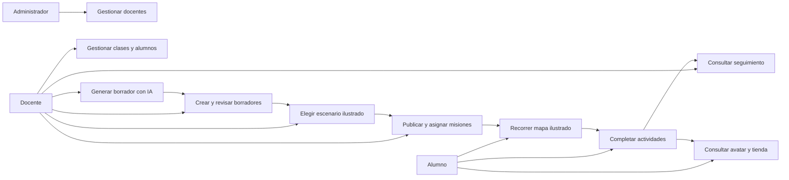
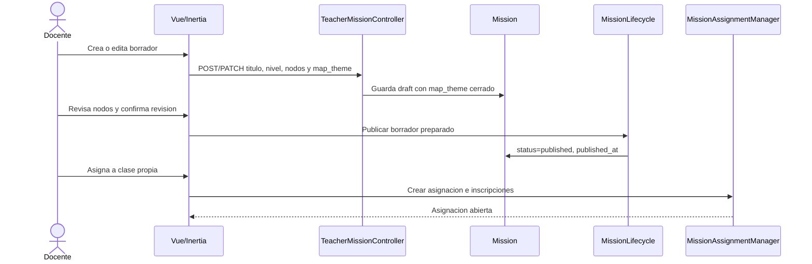
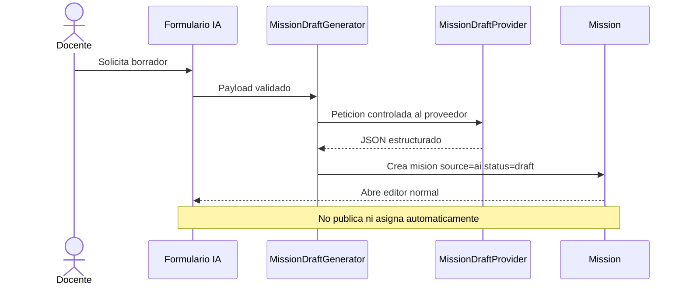
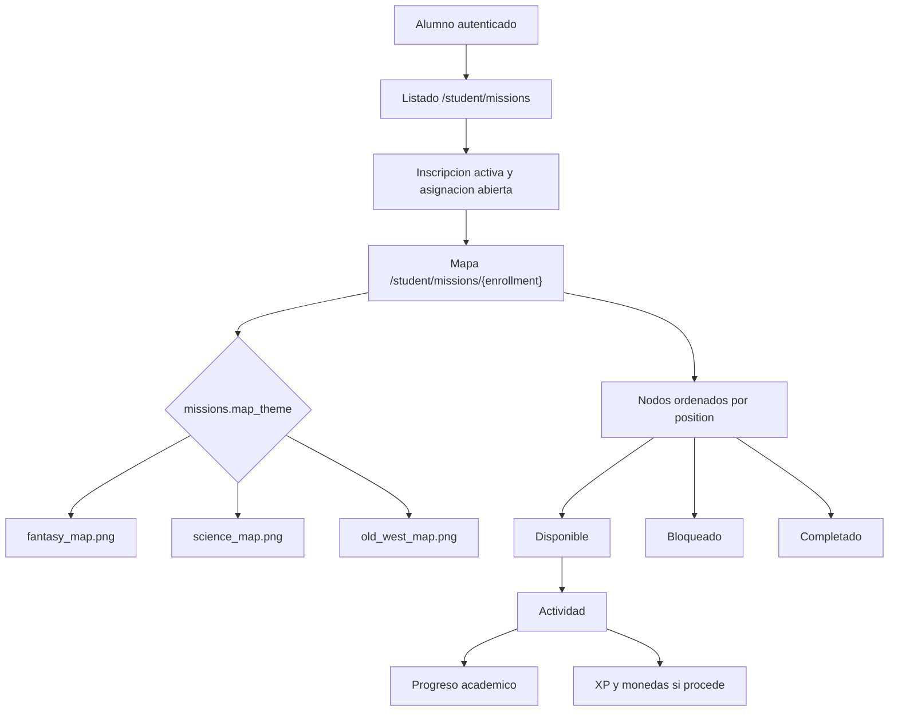
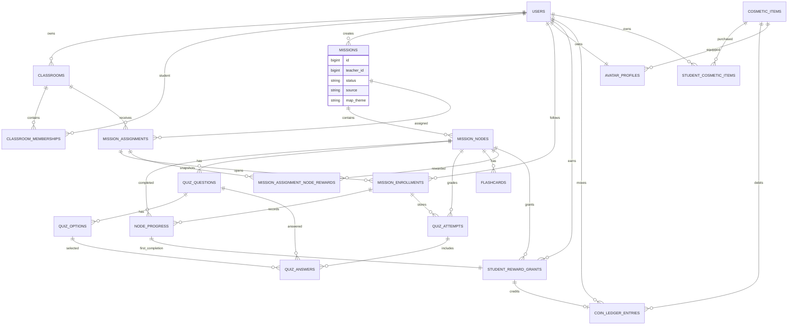
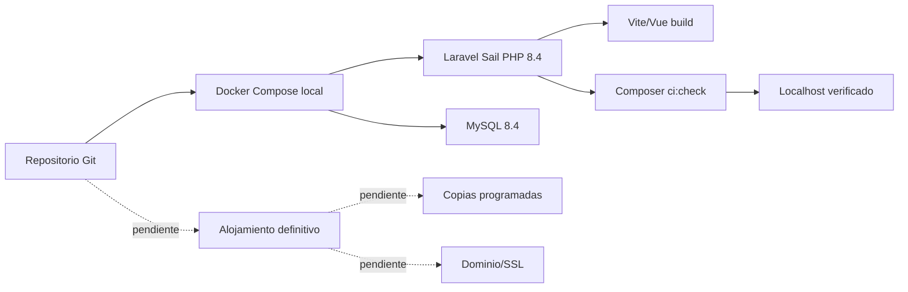

# Diagramas finales de EDUQuest

Fecha de revision documental: 2026-10-07.

Los diagramas reflejan el estado tecnico actual del repositorio. El despliegue local esta verificado; el alojamiento definitivo sigue pendiente.

## Casos de uso principales

## Flujo docente con escenario de mapa

## Generacion IA revisable

## Mapa ilustrado del alumno

## Modelo de datos resumido

## Despliegue y evidencias

## Exportaciones validadas

Los bloques Mermaid de este documento se renderizaron el 2026-10-07 con Mermaid CLI `10.9.2` mediante `npx --package @mermaid-js/mermaid-cli` y Chrome local configurado para Puppeteer. Los PNG y SVG generados estan en `docs/evidencias/diagramas-final/`.

## Enlaces relacionados

- [Memoria borrador final](memoria-borrador-final.md)
- [Estado del hito final](estado-hito-final.md)
- [Revision final de recorridos](revision-final-recorridos.md)
- [RFTP](rftp.md)
