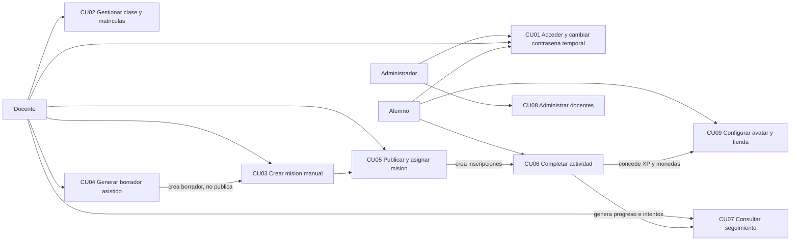
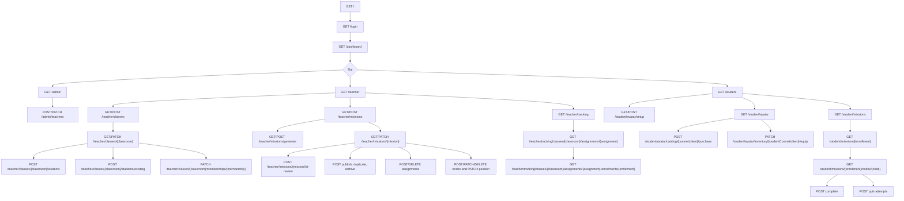
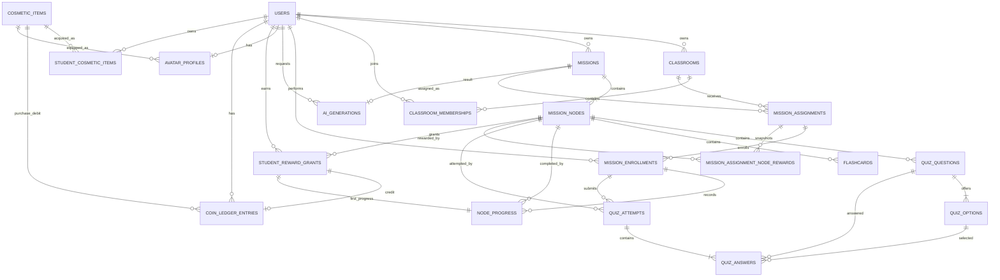
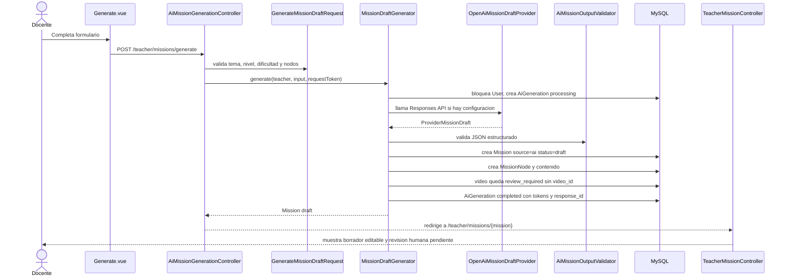
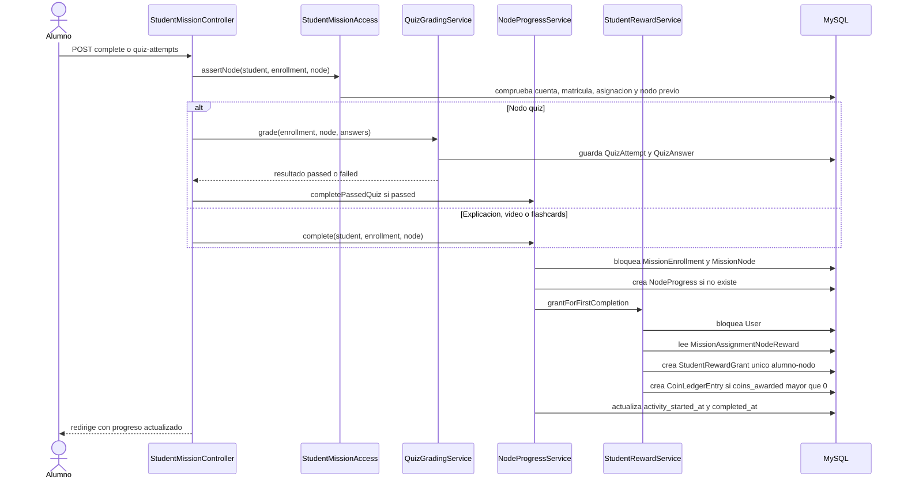
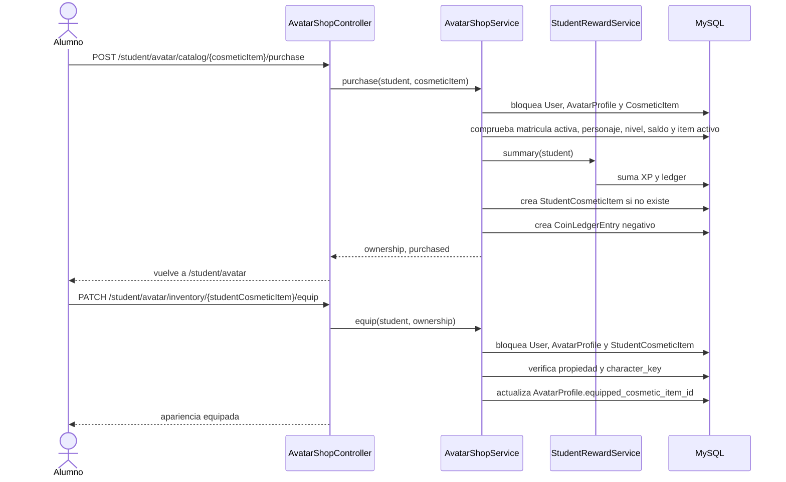
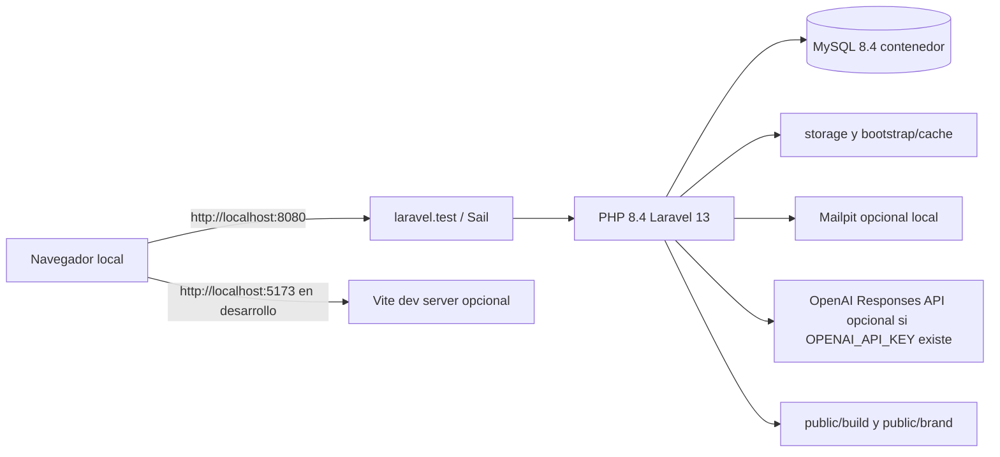
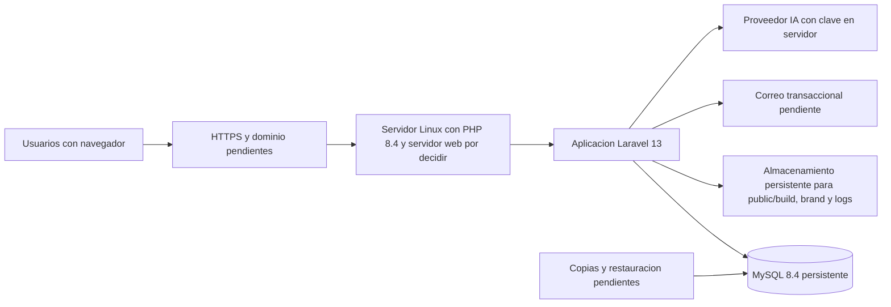

# Diagramas del hito del 80 %

> Diagramas revisados contra rutas, modelos, servicios, Policies y migraciones actuales. Fecha: 2026-10-05. No representan una infraestructura de produccion contratada.

## 1. Casos de uso

## 2. Navegacion y rutas implementadas

## 3. Clases principales

```mermaid
classDiagram
    class User
    class Classroom
    class ClassroomMembership
    class Mission
    class MissionNode
    class MissionAssignment
    class MissionEnrollment
    class NodeProgress
    class QuizAttempt
    class AiGeneration
    class AvatarProfile
    class CosmeticItem
    class StudentCosmeticItem
    class StudentRewardGrant
    class CoinLedgerEntry

    class TeacherMissionController
    class AiMissionGenerationController
    class TeacherTrackingController
    class StudentMissionController
    class AvatarSetupController
    class AvatarShopController

    class MissionLifecycle
    class MissionAssignmentManager
    class MissionEnrollmentSynchronizer
    class MissionNodeWriter
    class MissionReadiness
    class MissionDraftGenerator
    class OpenAiMissionDraftProvider
    class AiMissionOutputValidator
    class StudentMissionAccess
    class QuizGradingService
    class NodeProgressService
    class StudentRewardService
    class AvatarShopService

    class UserPolicy
    class ClassroomPolicy
    class ClassroomMembershipPolicy
    class MissionPolicy
    class MissionAssignmentPolicy
    class MissionEnrollmentPolicy
    class AvatarProfilePolicy
    class CosmeticItemPolicy
    class StudentCosmeticItemPolicy

    User "1" --> "many" Classroom : teacher owns
    User "1" --> "many" Mission : teacher owns
    User "1" --> "many" ClassroomMembership : student joins
    Mission "1" --> "many" MissionNode : nodes
    Mission "1" --> "many" MissionAssignment : assignments
    Mission "1" --> "0..1" AiGeneration : generated by
    MissionAssignment "1" --> "many" MissionEnrollment : enrollments
    MissionEnrollment "1" --> "many" NodeProgress : progress
    MissionEnrollment "1" --> "many" QuizAttempt : attempts
    User "1" --> "0..1" AvatarProfile : avatar
    User "1" --> "many" StudentRewardGrant : rewards
    User "1" --> "many" CoinLedgerEntry : ledger
    User "1" --> "many" StudentCosmeticItem : owns
    CosmeticItem "1" --> "many" StudentCosmeticItem : ownership

    TeacherMissionController --> MissionNodeWriter
    TeacherMissionController --> MissionReadiness
    AiMissionGenerationController --> MissionDraftGenerator
    MissionDraftGenerator --> OpenAiMissionDraftProvider
    MissionDraftGenerator --> AiMissionOutputValidator
    TeacherTrackingController --> MissionEnrollment
    StudentMissionController --> StudentMissionAccess
    StudentMissionController --> QuizGradingService
    StudentMissionController --> NodeProgressService
    NodeProgressService --> StudentRewardService
    AvatarSetupController --> AvatarShopService
    AvatarShopController --> AvatarShopService
    AvatarShopService --> StudentRewardService

    TeacherMissionController ..> MissionPolicy
    TeacherTrackingController ..> ClassroomPolicy
    TeacherTrackingController ..> MissionAssignmentPolicy
    TeacherTrackingController ..> MissionEnrollmentPolicy
    AvatarSetupController ..> AvatarProfilePolicy
    AvatarShopController ..> CosmeticItemPolicy
    AvatarShopController ..> StudentCosmeticItemPolicy
```

## 4. Modelo E/R logico

## 5. Secuencia R07: generacion asistida revisable

## 6. Secuencia R09: finalizacion y recompensa

## 7. Secuencia R09: compra y equipamiento cosmetico

## 8. Despliegue local comprobado

## 9. Despliegue definitivo pendiente

Este ultimo diagrama es provisional: no hay proveedor, dominio, HTTPS, correo ni politica de copias verificados todavia.

