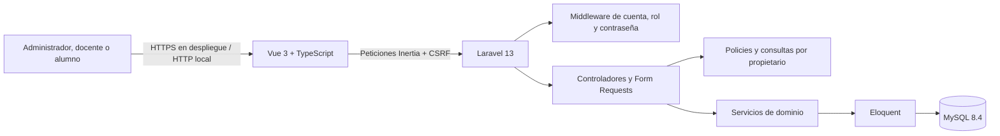
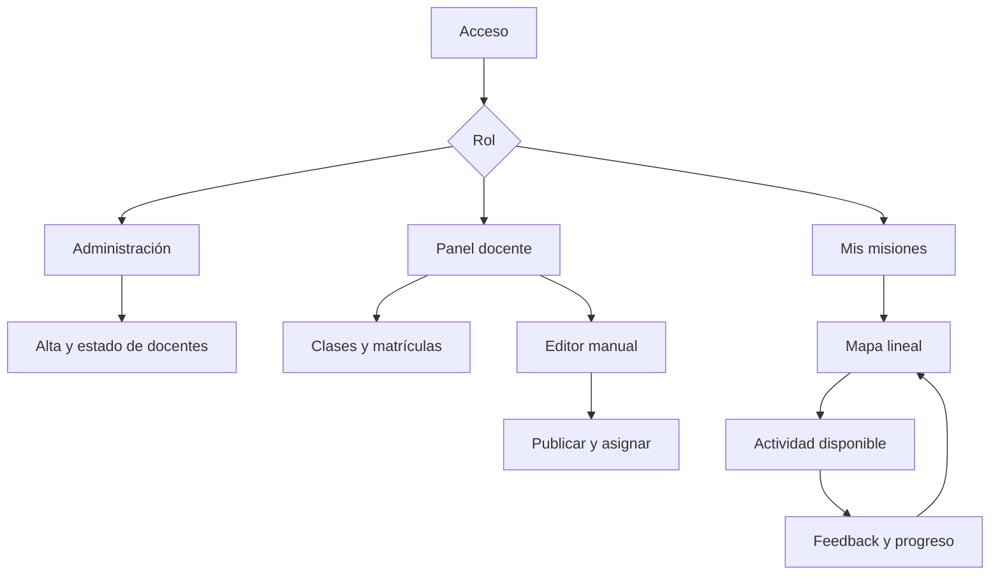
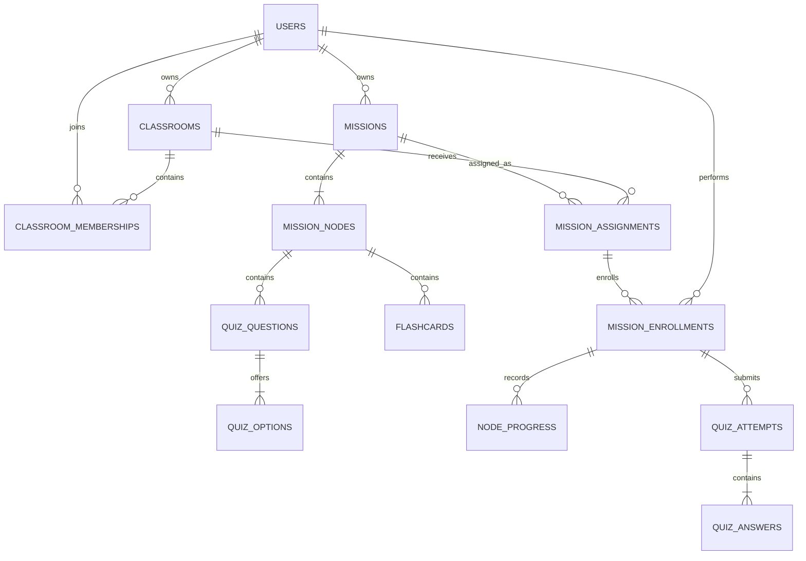
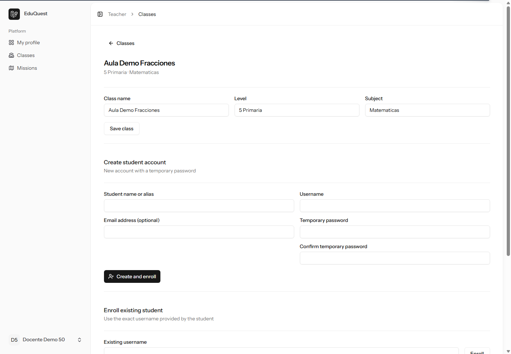
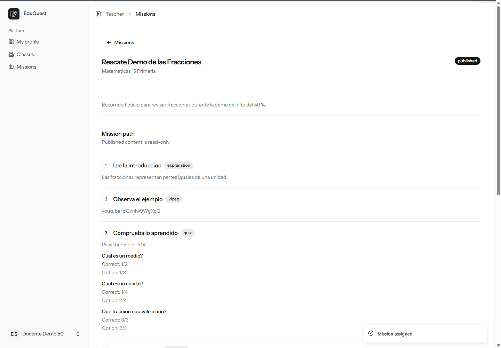
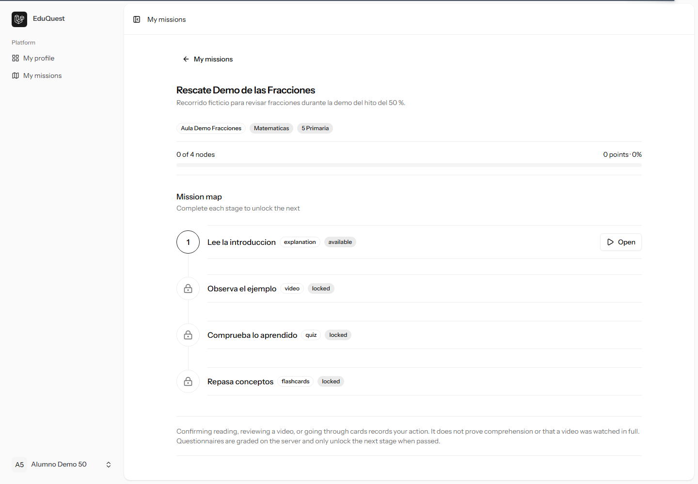
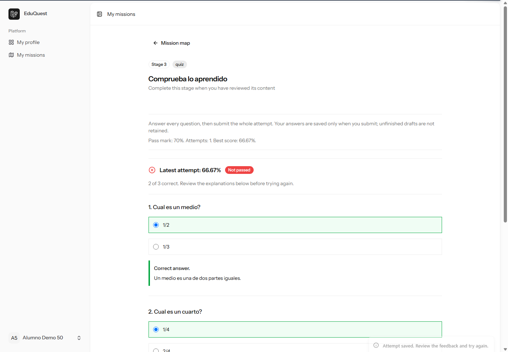
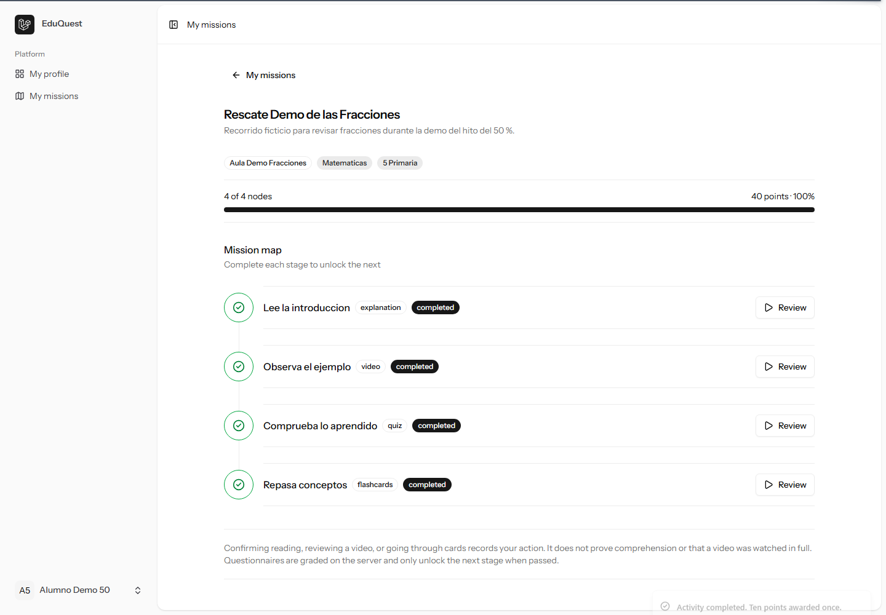

# EDUQuest: memoria técnica, borrador del hito del 50 %

> **Estado del documento.** Borrador de trabajo previo a la revisión académica. Describe únicamente el estado comprobado del repositorio hasta el commit `24f5455`. No acredita la entrega ni la aprobación del hito del 50 %, no sustituye la plantilla oficial y no contiene horas reales no registradas.

## Datos preliminares pendientes

- **Título definitivo del TFG:** pendiente de confirmar. `EDUQuest` es el nombre de trabajo.
- **Curso y modalidad:** pendiente de aportar.
- **Alumno:** David García; pendiente confirmar la forma exacta que debe aparecer en portada.
- **Tutor del TFG:** pendiente de aportar.
- **Fechas académicas:** pendientes de comunicación por el centro.
- **Abstract en español e inglés:** pendiente para una versión posterior, cuando el alcance y los resultados finales estén cerrados.
- **Índices de contenido, tablas e ilustraciones:** se generarán en la versión Word final.

## 1. Justificación del proyecto

EDUQuest surge como una propuesta para estructurar actividades de repaso en forma de misiones lineales. El problema abordado no es la ausencia absoluta de plataformas educativas, sino la necesidad de disponer de un flujo acotado en el que un docente pueda crear contenido, distribuirlo a sus clases y ofrecer al alumno una secuencia clara de actividades sin construir un videojuego completo ni una plataforma académica generalista.

El público previsto está formado por tres perfiles. El administrador controla el alta y la desactivación de docentes. El docente organiza clases y alumnos, prepara misiones y las asigna. El alumno realiza las actividades en orden y conserva su avance. La demostración actual utiliza contenido sintético de Primaria, aunque los campos de nivel y asignatura no están limitados a ese nivel.

La referencia conceptual son las antiguas misiones de Classcraft, pero el proyecto no reutiliza su código, identidad, datos ni recursos. El plan maestro también toma Moodle como término de comparación: Moodle ya ofrece restricciones de acceso y finalización, por lo que EDUQuest no presenta el desbloqueo secuencial como una innovación inédita. Su aportación académica está en construir y poder explicar una solución propia, más pequeña y centrada en un editor manual de misiones, cuatro actividades de repaso, permisos por propietario y un recorrido visual verificable.

No se ha realizado un estudio con alumnado real. Por ello, la memoria no afirma que EDUQuest mejore el aprendizaje o la motivación. En el estado actual solo puede demostrarse que el flujo funcional y sus controles técnicos se comportan como se ha definido.

## 2. Introducción

EDUQuest es una aplicación web monolítica desarrollada con Laravel e Inertia. Un docente crea una clase, da de alta o incorpora alumnos, redacta una misión y ordena nodos de explicación, vídeo, cuestionario y flashcards. Cuando el borrador es válido, puede publicarlo y asignarlo a una o varias clases propias. El alumno ve únicamente las misiones para las que mantiene matrícula e inscripción activas, y avanza por un mapa lineal.

El servidor decide qué recursos puede consultar cada persona. También valida los contenidos, corrige los cuestionarios, registra los intentos y calcula el progreso. El navegador no decide la nota, los puntos ni el desbloqueo de etapas. Esta separación permite probar reglas de dominio y autorización con independencia de la interfaz.

En el estado descrito por este borrador están implementados el acceso por roles, las clases y matrículas, el editor manual, la publicación y asignación, las cuatro actividades y el progreso del alumno. Todavía no existen el seguimiento docente de resultados ni la generación asistida por IA. Tampoco se ha realizado la entrega académica del hito.

## 3. Objetivos y RFTP

### 3.1 Objetivo general

Construir una aplicación web educativa en la que un docente pueda preparar y distribuir misiones de repaso y un alumno pueda completarlas de forma secuencial, con autorización en servidor, persistencia de intentos y progreso, y evidencias técnicas reproducibles.

### 3.2 Objetivos específicos

1. Controlar el acceso mediante cuentas activas y tres roles no autoasignables.
2. Separar los recursos de cada docente mediante Policies y consultas por propietario.
3. Gestionar clases, alumnos y matrículas sin borrar el historial al dar de baja una matrícula.
4. Crear y validar misiones manuales con cuatro tipos de nodo.
5. Publicar contenido inmutable y distribuirlo a clases propias.
6. Aplicar un recorrido lineal sin entregar al navegador contenido bloqueado.
7. Corregir cuestionarios en servidor y conservar todos los intentos.
8. Hacer idempotentes el progreso y los puntos, incluso ante peticiones simultáneas.
9. Incorporar más adelante seguimiento docente e IA con revisión humana.
10. Mantener trazabilidad entre requisitos, tareas, pruebas, commits y documentación.

### 3.3 Estado resumido del RFTP

| Requisito | Objetivo                               | Estado verificable en este borrador                                                                                                                                     |
| --------- | -------------------------------------- | ----------------------------------------------------------------------------------------------------------------------------------------------------------------------- |
| R01       | Acceso autorizado, roles y propiedad   | Parcial global. Identidad, sesiones, roles y Policies de los recursos existentes están implementados y probados; deberá extenderse a los recursos futuros.              |
| R02       | Clases, alumnos y matrículas           | Implementado y probado, incluidas baja, reincorporación y sincronización con inscripciones abiertas.                                                                    |
| R03       | Preparación y distribución de misiones | Implementado y probado para creación manual, publicación, copia, archivo y asignación.                                                                                  |
| R04       | Actividades de repaso                  | Implementado y probado para explicación, vídeo, cuestionario y flashcards.                                                                                              |
| R05       | Desbloqueo, progreso y puntos          | Implementado y probado, incluida una carrera de dos finalizaciones HTTP simultáneas contra MySQL.                                                                       |
| R06       | Seguimiento docente                    | Planificado; no implementado.                                                                                                                                           |
| R07       | Borradores asistidos por IA            | Planificado; no implementado ni simulado como integración real.                                                                                                         |
| R08       | Instalación, pruebas y documentación   | Parcial. Existen contenedores, README, pruebas, guía de demo y evidencias; faltan horas reales, diagramas finales, instalación limpia, restauración y cierre académico. |

La definición completa de funciones, tareas y pruebas conserva los identificadores `R01`–`R08` en [rftp.md](rftp.md). Las pruebas no se consideran realizadas por estar escritas en el plan: solo se marcan como superadas cuando existe una ejecución o evidencia registrada.

## 4. Descripción de la solución

### 4.1 Arquitectura actual

La aplicación usa una arquitectura de monolito modular. Laravel recibe las peticiones, autentica la sesión, autoriza el recurso, valida los datos y persiste el resultado con Eloquent. Inertia entrega a Vue las propiedades necesarias para cada página, sin una API REST separada. MySQL conserva usuarios, clases, contenido, asignaciones, intentos y progreso.

Los controladores están separados por áreas `Admin`, `Teacher` y `Student`. Los Form Requests validan entradas, las Policies comprueban propietario y rol, y los servicios concentran reglas como publicación, sincronización de inscripciones, acceso del alumno, corrección y progreso. Las páginas Vue se encuentran igualmente separadas por perfil.

### 4.2 Reglas principales implementadas

- El registro público está desactivado. El primer administrador se crea con un comando interactivo.
- Cada usuario tiene un `username` único, un rol, un estado activo y una marca de cambio obligatorio de contraseña.
- Una clase y una misión pertenecen a un docente. Conocer un identificador ajeno no concede acceso.
- Una matrícula inactiva no elimina la cuenta ni el historial.
- Solo se publica un borrador completo. Una misión publicada es inmutable y se duplica para editar una copia.
- Una misión archivada no recibe nuevas asignaciones, pero no borra las existentes.
- El mapa deriva los estados disponible, bloqueado y completado. El contenido se consulta en otra ruta después de repetir los controles.
- La nota se calcula como aciertos entre preguntas por cien. El umbral se compara sin redondear.
- Cada finalización concede diez puntos una sola vez gracias a transacción, bloqueo y restricción única.

### 4.3 Casos de uso

#### CU01. Acceder

- **Estado:** implementado y probado.
- **Actores:** administrador, docente y alumno.
- **Descripción:** iniciar sesión mediante `username` y contraseña y redirigir al panel correspondiente.
- **Precondiciones:** cuenta existente y activa.
- **Postcondiciones:** sesión regenerada y acceso al área del rol; si la contraseña es temporal, redirección previa al cambio obligatorio.
- **Entradas:** `username`, contraseña y opción de recordar sesión.
- **Salidas:** sesión autenticada, errores de validación o limitación temporal de intentos.
- **Tablas:** `users`, `sessions`, `password_reset_tokens`.
- **Clases principales:** `FortifyServiceProvider`, `EnsureUserIsActive`, `EnsureUserHasRole`, `EnsurePasswordWasChanged`.
- **Interfaces:** acceso, recuperación y cambio obligatorio de contraseña.

#### CU02. Gestionar una clase

- **Estado:** implementado y probado.
- **Actor:** docente.
- **Descripción:** crear o editar una clase propia, crear una cuenta de alumno o incorporar una existente mediante su `username`, y activar o desactivar la matrícula.
- **Precondiciones:** docente autenticado y activo.
- **Postcondiciones:** clase asociada al docente y matrícula única conservada aunque se desactive.
- **Entradas:** nombre, nivel, asignatura y datos mínimos del alumno.
- **Salidas:** clase y lista de matrículas con su estado.
- **Tablas:** `users`, `classrooms`, `classroom_memberships`, además de inscripciones si existen asignaciones abiertas.
- **Clases principales:** `TeacherClassroomController`, `StudentEnrollmentController`, `ClassroomPolicy`, `ClassroomMembershipPolicy`, `MissionEnrollmentSynchronizer`.
- **Interfaces:** listado de clases y detalle de clase.

#### CU03. Crear una misión manual

- **Estado:** implementado y probado.
- **Actor:** docente.
- **Descripción:** crear un borrador, editar sus datos generales y añadir, modificar, eliminar o reordenar nodos.
- **Precondiciones:** docente autenticado; misión propia en estado borrador.
- **Postcondiciones:** contenido normalizado y orden persistente; indicador de preparación calculado desde lo almacenado.
- **Entradas:** título, descripción, asignatura, nivel y contenido específico de cada tipo de nodo.
- **Salidas:** borrador guardado o errores concretos de validación.
- **Tablas:** `missions`, `mission_nodes`, `quiz_questions`, `quiz_options`, `flashcards`.
- **Clases principales:** `TeacherMissionController`, `MissionNodeController`, `MissionNodeWriter`, `MissionReadiness`, `ValidVideoReference`.
- **Interfaces:** listado de misiones y editor de misión.

#### CU04. Generar un borrador asistido

- **Estado:** planificado, no implementado.
- **Actor previsto:** docente.
- **Descripción prevista:** solicitar una propuesta estructurada a un proveedor de IA, validar su salida y guardarla únicamente como borrador revisable.
- **Precondiciones previstas:** proveedor y política del centro definidos, credencial solo en servidor y cuota disponible.
- **Postcondiciones previstas:** borrador editable o error recuperable; nunca publicación automática.
- **Pendiente:** proveedor, modelo, coste, esquema definitivo, timeout, cuota, registro de consumo, pruebas con fake identificado y una llamada real demostrable.

#### CU05. Publicar y asignar

- **Estado:** implementado y probado.
- **Actor:** docente.
- **Descripción:** publicar un borrador preparado, duplicar una misión publicada, archivarla o asignarla a una o varias clases propias.
- **Precondiciones:** misión propia; para publicar debe superar `MissionReadiness`; para asignar debe estar publicada y no archivada.
- **Postcondiciones:** contenido publicado inmutable y una asignación única por pareja misión-clase, con inscripciones para matrículas activas.
- **Entradas:** identificador de misión y clases seleccionadas.
- **Salidas:** estado de publicación y asignaciones con sus contadores.
- **Tablas:** `missions`, tablas de contenido, `mission_assignments`, `mission_enrollments`.
- **Clases principales:** `MissionLifecycleController`, `MissionAssignmentController`, `MissionLifecycle`, `MissionAssignmentManager`.
- **Interfaces:** detalle de misión publicada y bloque de asignaciones.

#### CU06. Completar una actividad

- **Estado:** implementado y probado.
- **Actor:** alumno.
- **Descripción:** abrir un nodo disponible, enviar una confirmación o las respuestas completas de un cuestionario y volver al mapa con el progreso actualizado.
- **Precondiciones:** cuenta, matrícula e inscripción activas; asignación abierta; nodo perteneciente a la misión; nodo anterior completado.
- **Postcondiciones:** intento persistido cuando procede; finalización única si se cumple la condición; siguiente nodo desbloqueado y diez puntos concedidos una sola vez.
- **Entradas:** inscripción, nodo y confirmación, tarjetas revisadas o respuestas según el tipo.
- **Salidas:** errores de acceso/validación, feedback del cuestionario, progreso y puntos.
- **Tablas:** `mission_enrollments`, `mission_nodes`, `node_progress`, `quiz_attempts`, `quiz_answers`.
- **Clases principales:** `StudentMissionController`, `StudentMissionAccess`, `NodeProgressService`, `QuizGradingService`.
- **Interfaces:** misiones del alumno, mapa y actividad.
- **Alternativas comprobadas:** nodo bloqueado, baja de matrícula, ID ajeno, respuestas incompletas o manipuladas, nota insuficiente y reenvío repetido o simultáneo.

#### CU07. Consultar seguimiento

- **Estado:** planificado, no implementado.
- **Actor previsto:** docente.
- **Descripción prevista:** consultar por clase y asignación el porcentaje de avance, intentos y mejor nota de cada alumno autorizado.
- **Pendiente:** consultas, Policies específicas, filtros, interfaz, separación visual entre avance y calificación y pruebas con dos docentes y alumnos conocidos.

#### CU08. Administrar cuentas docentes

- **Estado:** implementado y probado.
- **Actor:** administrador.
- **Descripción:** crear docentes con contraseña temporal y activar o desactivar sus cuentas.
- **Precondiciones:** administrador autenticado y activo.
- **Postcondiciones:** docente con rol fijado en servidor y cambio de contraseña pendiente, o cuenta desactivada sin acceso aunque conserve una sesión.
- **Entradas:** nombre, `username`, email y contraseña temporal.
- **Salidas:** listado de docentes y estado de cada cuenta.
- **Tablas:** `users`.
- **Clases principales:** `AdminTeacherController`, `StoreTeacherRequest`, `UpdateTeacherStatusRequest`, `UserPolicy`.
- **Interfaces:** panel de administración.

## 5. Diseños y diagramas

### 5.1 Navegación implementada hasta R05

Las ramas de seguimiento docente e IA no aparecen como disponibles porque todavía no existen. La interfaz actual utiliza páginas Inertia y controles subir/bajar para ordenar nodos; no depende de arrastrar elementos.

### 5.2 Modelo de datos actual resumido

El esquema implementado contiene las entidades de identidad, clases, contenido, distribución y actividad. Entre las restricciones relevantes están `username` único, clase-alumno único, misión-posición única, misión-clase única, asignación-alumno única, inscripción-nodo único y respuesta por pregunta e intento única.

Este diagrama es un resumen lógico. La versión final deberá añadir tipos, nulabilidad, índices y todas las claves foráneas a partir de las migraciones.

### 5.3 Evidencias de interfaz

**Figura 1. Clase propia y formulario de alta controlada de alumno.**

**Figura 2. Misión publicada con sus tipos de nodo en modo de lectura.**

**Figura 3. Mapa inicial del alumno con un nodo disponible y tres bloqueados.**

**Figura 4. Intento suspendido con 2 de 3 respuestas y feedback posterior al envío.**

**Figura 5. Misión completada con cuatro nodos, 40 puntos y 100 %.**

Las imágenes usan cuentas y contenido ficticios y no contienen contraseñas ni datos de menores reales.

### 5.4 Diagramas y diseños pendientes

- Diagrama general de casos de uso con actores y relaciones CU01–CU08.
- Diagrama de clases completo, incluyendo controladores, servicios, modelos y Policies relevantes.
- Diagrama E/R definitivo y diagrama físico de base de datos con campos, tipos, nulabilidad, índices y claves.
- Diagrama de secuencia de publicación/asignación y otro de corrección/finalización concurrente.
- Diagrama de red y despliegue, pendiente de elegir alojamiento y arquitectura final.
- Capturas adaptables en móvil y comprobación de navegación por teclado.
- Diseños del seguimiento docente y de la generación asistida, que no deben presentarse todavía como pantallas funcionales.

## 6. Tecnologías

| Tecnología                             | Uso real comprobado                                       | Estado o versión registrada                                   |
| -------------------------------------- | --------------------------------------------------------- | ------------------------------------------------------------- |
| PHP                                    | Ejecución del servidor y reglas de dominio                | 8.4.26 en Sail                                                |
| Laravel                                | Rutas, Fortify, validación, Policies, Eloquent y comandos | 13.33.0                                                       |
| Vue + TypeScript                       | Páginas y componentes de la interfaz                      | Starter oficial; comprobado con `vue-tsc --noEmit`            |
| Inertia                                | Navegación y propiedades entre Laravel y Vue              | 3.x según dependencias bloqueadas                             |
| Tailwind CSS y componentes del starter | Presentación y controles                                  | Integrados en el frontend actual                              |
| MySQL                                  | Persistencia relacional y prueba de concurrencia          | 8.4.11                                                        |
| Docker Compose / Sail                  | Entorno local reproducible                                | Docker Desktop 4.45.0; motor 28.3.3                           |
| Pest                                   | Pruebas unitarias y de características                    | 5.2.1                                                         |
| PHPStan con Larastan                   | Análisis estático del backend                             | Sin errores en 114 archivos en la última ejecución registrada |
| Pint                                   | Formato PHP                                               | 140 archivos correctos en la última ejecución registrada      |
| Vite Plus y Vite                       | Formato/lint, desarrollo y build frontend                 | Build registrado con 3395 módulos transformados               |
| Git y GitHub                           | Historial y repositorio remoto                            | Rama `main`; último commit considerado `24f5455`              |
| Chrome                                 | Recorrido real de demostración                            | Usado localmente mediante el protocolo de depuración          |

La autenticación usa sesiones, cookies y CSRF. No se ha introducido una API REST independiente, JWT, microservicios, Pinia ni Vue Router porque el alcance actual no los necesita. Playwright figuraba en el plan inicial, pero no está instalado: la evidencia de navegador de este hito se obtuvo con Chrome y automatización local mediante CDP. La integración de IA y su proveedor siguen pendientes.

## 7. Metodología

### 7.1 Forma de trabajo

Se sigue un desarrollo incremental por hitos. Cada encargo autorizado parte de la lectura del plan y del código existente, limita el alcance a una parte del RFTP, implementa pruebas y actualiza el estado documental. No se afirma que se esté aplicando Scrum ni otra metodología formal con ceremonias que no constan en las evidencias.

El ciclo usado en las tareas realizadas ha sido: revisar contexto, implementar un incremento pequeño, ejecutar pruebas focalizadas, ejecutar controles globales, documentar el resultado y crear un commit comprensible. La separación por capas permite probar las reglas del servidor sin depender de capturas, mientras que el recorrido en navegador comprueba la integración visible.

### 7.2 Trazabilidad mediante Git

| Commit    | Incremento documentado                               |
| --------- | ---------------------------------------------------- |
| `75e2bbb` | Base Laravel 13 y entorno reproducible.              |
| `5273e65` | Identidad, roles y acceso controlado de R01.         |
| `9116036` | Clases, alumnos y matrículas de R02F01.              |
| `98f04c3` | Editor y validación de borradores de R03F01.         |
| `ada2647` | Publicación, archivo, copia y asignación de R03F02.  |
| `9c0a9e1` | Primer recorrido del alumno y progreso.              |
| `c3616b2` | Cuestionarios corregidos en servidor.                |
| `24f5455` | Revisión integral del recorrido y concurrencia real. |

### 7.3 Comprobaciones registradas

La última revisión conservada ejecutó una selección de seguridad con 55 pruebas y 462 aserciones. La cadena completa terminó con 102 pruebas y 639 aserciones; 9 pruebas del starter quedaron omitidas porque la verificación de email de Fortify está desactivada. El análisis estático no encontró errores, TypeScript y los controles de formato/lint pasaron, y el frontend compiló correctamente.

La prueba de concurrencia lanzó dos peticiones de finalización simultáneas contra MySQL. Ambas acabaron en respuestas controladas, y la consulta posterior mostró una sola fila de progreso y diez puntos totales. Este resultado está documentado en [evidencias-hito-50.md](evidencias-hito-50.md).

### 7.4 Uso de asistencia de Codex

Codex ha participado en lectura, implementación, pruebas y documentación bajo instrucciones concretas y con revisión basada en el repositorio. La declaración definitiva sobre herramientas generativas deberá adaptarse a la normativa que comunique el centro. El alumno debe revisar y poder explicar el modelo de datos, las Policies, la corrección del cuestionario, el desbloqueo y cualquier integración futura antes de presentar el trabajo.

## 8. Planificación y presupuesto

### 8.1 Planificación inicial

El plan maestro contiene una estimación inicial de 200 horas. Es una hipótesis previa y no equivale al tiempo trabajado. Las fechas oficiales de propuesta, 50 %, 80 % y entrega final siguen pendientes.

| Requisito          | Estimación inicial |
| ------------------ | -----------------: |
| R01                |               16 h |
| R02                |               12 h |
| R03                |               20 h |
| R04                |               24 h |
| R05                |               24 h |
| R06                |               12 h |
| R07                |               24 h |
| R08                |               68 h |
| **Total previsto** |          **200 h** |

Las referencias acumuladas del plan son 20 horas para propuesta, 100 hasta el hito del 50 %, 160 hasta el 80 % y 200 para la entrega final. Son objetivos de planificación, no mediciones reales ni porcentajes académicos ya aceptados.

### 8.2 Planificación real

No puede calcularse todavía. [registro-horas.md](registro-horas.md) conserva únicamente una plantilla sin sesiones reales anotadas. Los commits prueban evolución técnica, pero no permiten inferir duración. Faltan las fechas académicas, la disponibilidad semanal, un Gantt inicial calendarizado y el registro real por tarea RFTP. El análisis de desviaciones se redactará cuando existan esos datos.

### 8.3 Presupuesto

El plan incluyó un presupuesto académico ilustrativo de `200 h × 20 €/h = 4.000 €` como valoración del trabajo. También propuso reservas no verificadas de 20 € para API, 30 € para alojamiento y 15 € para un dominio opcional, con un techo provisional de 4.065 €. Estas cantidades no son gastos realizados ni tarifas vigentes confirmadas.

El presupuesto real queda pendiente de conocer horas efectivas, proveedor de IA, alojamiento, dominio y requisitos del centro. El desarrollo actual funciona localmente y no demuestra ningún coste de despliegue o consumo de API.

## 9. Trabajos futuros

1. Implementar R06: seguimiento docente individual y de clase, con progreso, intentos y mejor nota filtrados por propietario.
2. Implementar R07: generación real de borradores con IA, salida estructurada validada, cuota, timeout, errores recuperables y revisión obligatoria.
3. Completar las Policies y pruebas de propiedad para los nuevos recursos de R06 y R07.
4. Diseñar y verificar la experiencia adaptable, la navegación por teclado, el foco visible y el comportamiento móvil.
5. Añadir datos de demo reproducibles sin credenciales fijas ni información personal.
6. Documentar y ejecutar una instalación limpia, copia y restauración de MySQL y despliegue con HTTPS.
7. Completar los diagramas indicados en el apartado de diseño y generar índices automáticos en la memoria final.
8. Registrar horas reales y comparar la planificación inicial con la ejecución.
9. Incorporar el feedback del centro cuando se produzca, sin marcarlo anticipadamente.

Las ampliaciones como ramificaciones, multijugador, rankings, chat, familias, aplicación móvil nativa, suscripciones, SCORM o tutor conversacional siguen fuera del MVP.

## 10. Conclusiones provisionales

El estado actual demuestra que la parte manual principal de EDUQuest puede ejecutarse de extremo a extremo con datos ficticios: un administrador crea un docente; el docente gestiona clase, alumno y misión; y el alumno completa los cuatro tipos de actividad en orden. Las pruebas cubren reglas que no son visibles en una captura, como el aislamiento entre docentes, la ausencia de soluciones antes del envío, el rechazo de nodos bloqueados y la idempotencia concurrente de los puntos.

La arquitectura elegida ha permitido mantener juntas la interfaz y las reglas del servidor sin crear una API separada. Las restricciones de base de datos, las transacciones y las Policies complementan la validación de las peticiones. El proceso también ha mostrado la importancia de distinguir evidencia visual de evidencia de servidor y de repetir la cadena completa después de corregir un problema.

Estas conclusiones no son las conclusiones finales del TFG. No se han evaluado efectos pedagógicos, no se ha implementado seguimiento docente ni IA, no se ha validado un despliegue y no existen horas reales suficientes para valorar desviaciones. La conclusión profesional definitiva deberá incorporar esos resultados, los problemas encontrados y el feedback académico real.

## 11. Referencias

Las siguientes referencias proceden del plan maestro. Antes de cerrar la memoria deberán revisarse el formato APA exigido, los datos editoriales y la fecha de consulta definitiva.

- **Aplicada a la selección de versión del framework y compatibilidad del servidor.** Laravel. (s. f.). _Release Notes_. Recuperado de https://laravel.com/docs/13.x/releases
- **Aplicada a la base Vue, TypeScript, Inertia y autenticación del proyecto.** Laravel. (s. f.). _Starter Kits_. Recuperado de https://laravel.com/docs/13.x/starter-kits
- **Aplicada a la comunicación entre controladores Laravel y páginas Vue.** Inertia.js. (s. f.). _Inertia.js_. Recuperado de https://inertiajs.com/
- **Aplicada al diseño y operación de la persistencia relacional.** Oracle. (s. f.). _MySQL 8.4 Reference Manual_. Recuperado de https://dev.mysql.com/doc/refman/8.4/en/
- **Aplicada a la comparación de restricciones y liberación condicional de actividades.** Moodle. (s. f.). _Restrict access settings_. Recuperado de https://docs.moodle.org/en/Restrict_access_settings
- **Aplicada al contexto del antecedente de misiones y al uso prudente de la marca Classcraft.** HMH. (s. f.). _HMH Classcraft_. Recuperado de https://www.hmhco.com/programs/classcraft

### Fuentes internas y evidencias del proyecto

- García, D. (2026). _EduQuest: plan maestro del proyecto DAW_. Documento interno del repositorio.
- EDUQuest. (s. f.). _RFTP: requisitos, funciones, tareas y pruebas_. [rftp.md](rftp.md).
- EDUQuest. (s. f.). _Estado del proyecto_. [estado-proyecto.md](estado-proyecto.md).
- EDUQuest. (s. f.). _Guía de demo del hito del 50 %_. [guia-demo-hito-50.md](guia-demo-hito-50.md).
- EDUQuest. (s. f.). _Evidencias de revisión del hito del 50 %_. [evidencias-hito-50.md](evidencias-hito-50.md).

## 12. Información necesaria para completar la memoria

Este apartado se mantiene como lista de control y deberá eliminarse o integrarse antes de la versión final:

- Título definitivo del TFG.
- Nombre completo del alumno tal como debe figurar, curso, modalidad y tutor.
- Calendario oficial y denominación exacta de cada entrega.
- Horas reales por sesión y por tarea RFTP.
- Tarifa u otro criterio que exija el centro para el presupuesto.
- Normas del centro sobre uso y declaración de IA generativa.
- Formato APA o guía bibliográfica concreta que deba aplicarse.
- Plantilla o herramienta exigida para Gantt y diagramas.
- Requisitos de extensión, idioma del abstract, numeración y anexos.
- Feedback real recibido sobre propuesta o hito, cuando exista.
- Proveedor de IA, alojamiento y dominio si llegan a aprobarse y contratarse.
- Decisión sobre tratamiento de datos y consentimiento si se prueba con personas reales.
