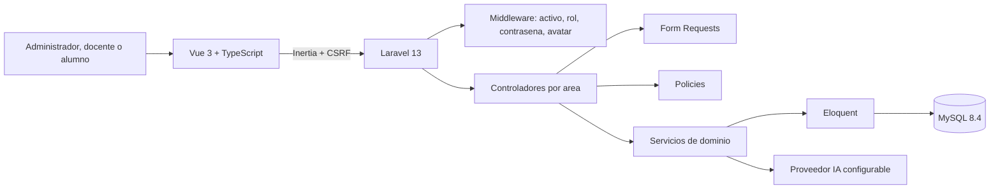
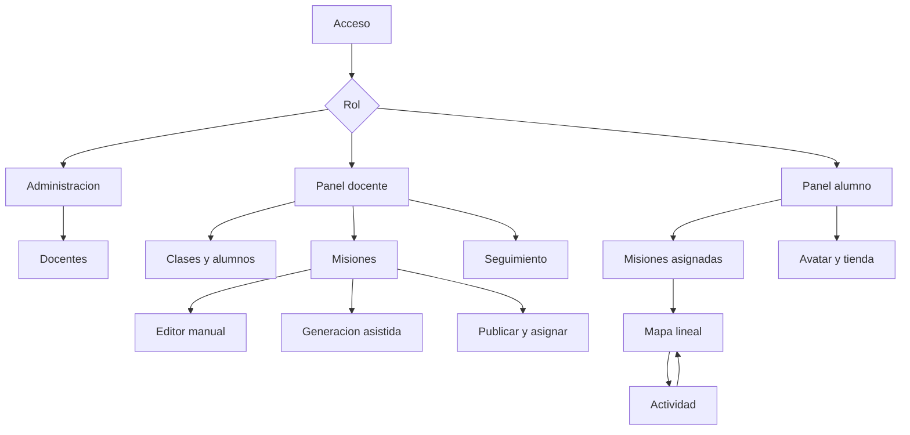
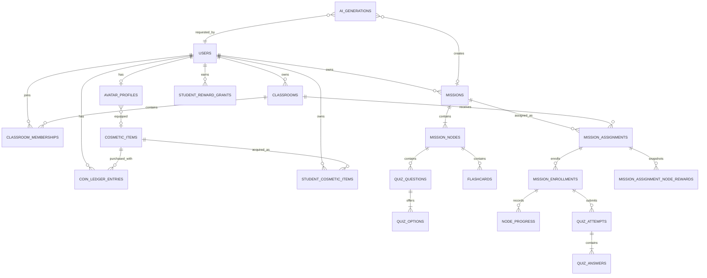

# EDUQuest: memoria tecnica, borrador del hito del 80 %

> Estado del documento: borrador de trabajo para revision. Describe el estado comprobado del repositorio a fecha 2026-10-05. No acredita entrega ni aprobacion academica, no inventa horas y no sustituye la plantilla oficial del centro.

## Datos preliminares pendientes

- Titulo definitivo del TFG: pendiente de confirmar. `EDUQuest` es el nombre de trabajo.
- Alumno: David Garcia; pendiente confirmar forma exacta para portada.
- Tutor, curso, modalidad, fechas oficiales y criterios de evaluacion: pendientes del centro.
- Abstract, indices y formato bibliografico definitivo: pendientes para la version final.

## 1. Justificacion

EDUQuest propone una aplicacion web para convertir repasos en misiones visuales. El docente prepara contenido, lo asigna a una clase y consulta el avance; el alumno completa actividades en orden y conserva su progreso. La demo actual usa datos ficticios de Primaria y no incluye alumnado real.

La referencia conceptual son experiencias de misiones educativas como Classcraft, sin reutilizar codigo, identidad, recursos ni datos externos. EDUQuest tampoco afirma demostrar una mejora pedagogica: en este hito se verifica que el flujo tecnico funciona, que las reglas se aplican en servidor y que la interfaz permite explicar el recorrido.

## 2. Introduccion

La aplicacion es un monolito Laravel con interfaz Vue mediante Inertia. El servidor autentica, autoriza, valida, corrige cuestionarios, persiste intentos y calcula progreso. El navegador presenta la experiencia, pero no decide nota, puntos, desbloqueos, XP, monedas ni permisos.

Desde el borrador del 50 % se han incorporado el seguimiento docente R06, la generacion asistida R07 y la ampliacion R09 de avatar, recompensas y tienda cosmetica. R09 se identifica como ampliacion posterior al plan maestro, no como requisito inicial.

## 3. Objetivos y RFTP

| RFTP | Objetivo | Estado hito 80 |
|---|---|---|
| R01 | Acceso autorizado, roles y propiedad | Implementado en los recursos actuales. |
| R02 | Clases, alumnos y matriculas | Implementado y probado. |
| R03 | Preparar y distribuir misiones | Implementado y probado. |
| R04 | Actividades de repaso | Implementado y probado. |
| R05 | Desbloqueo y progreso persistente | Implementado y probado, con concurrencia MySQL registrada para progreso educativo. |
| R06 | Seguimiento docente | Implementado y probado. |
| R07 | Borradores asistidos por IA con revision | Implementado y probado; existe una llamada real controlada registrada. |
| R08 | Instalacion, pruebas, documentacion y evidencias | Parcial; quedan horas, capturas finales, instalacion limpia, copia/restauracion y cierre academico. |
| R09 | Avatar, recompensas y tienda cosmetica | Ampliacion posterior parcialmente cerrada; MVP implementado, faltan carreras HTTP especificas de recompensas/compras. |

## 4. Descripcion de la solucion

### Arquitectura

La arquitectura real mantiene un unico repositorio y no crea API REST separada. Los controladores estan divididos en `Admin`, `Teacher` y `Student`; las reglas complejas se concentran en servicios como publicacion, asignaciones, acceso de alumno, progreso, correccion de quiz, generacion IA y tienda.

### Casos de uso

- CU01 Acceder: implementado con login por `username`, sesiones, cuenta activa y cambio obligatorio.
- CU02 Gestionar clase: implementado con clases propias, alumnos, matriculas, baja y reincorporacion.
- CU03 Crear mision manual: implementado con cuatro tipos de nodo y validacion de borrador.
- CU04 Generar borrador asistido: implementado como borrador revisable, sin publicacion ni asignacion automatica.
- CU05 Publicar y asignar: implementado con contenido inmutable, copia, archivo y asignaciones unicas.
- CU06 Completar actividad: implementado con desbloqueo lineal, intentos de quiz y progreso persistente.
- CU07 Consultar seguimiento: implementado con resumen y detalle por alumno autorizado.
- CU08 Administrar docentes: implementado para alta, activacion y desactivacion.
- CU09 Personalizar avatar y tienda: implementado como ampliacion estetica posterior.

## 5. Disenos y diagramas

### Navegacion implementada

### Modelo de datos logico actualizado

### Diseno futuro explicito

El despliegue definitivo con HTTPS, proveedor, dominio, copias y restauracion sigue siendo diseno futuro. Tambien son futuro las colecciones adicionales de avatar, piezas por capas, ramificaciones de misiones, multijugador, rankings, chat, familias, app movil, SCORM y tutor conversacional.

## 6. Tecnologias

El proyecto usa PHP 8.4 en Sail, Laravel 13, Vue 3, TypeScript, Inertia, Tailwind CSS, shadcn-vue, MySQL 8.4, Pest, PHPStan, Pint, Vite y Docker Compose. La autenticacion usa sesiones, cookies y CSRF. La IA usa un proveedor configurable desde servidor, con clave en `.env` y sin variables `VITE_*`.

## 7. Implementacion comprobable

- R01-R05 mantienen el flujo manual completo del hito anterior.
- R06 anade seguimiento por clase y asignacion sin modificar progreso.
- R07 crea misiones `source=ai` en estado `draft`; los videos quedan pendientes de revision y la publicacion exige confirmacion humana.
- R09 anade perfil de avatar, catalogo cosmetico, XP, nivel y monedas separados de la evaluacion academica.
- El comando `eduquest:prepare-demo` prepara datos ficticios para `carlinchis` y `alumno_demo`, sin crear progreso ni compras.

## 8. Pruebas y evidencias

La cadena `composer ci:check` se ejecuto durante esta revision: formato/lint frontend, `vue-tsc`, Pint y PHPStan pasaron; Pest termino con `143 passed`, `1217 assertions` y `9 skipped` por verificacion de email desactivada. Las cifras historicas de R01-R09 se mantienen en `docs/estado-proyecto.md`, pero no sustituyen las capturas pendientes del 80 %.

Tambien se ejecuto `php artisan eduquest:prepare-demo`: la demo quedo con 5 misiones, 20 actividades, 200 XP disponibles y 45 monedas disponibles para `alumno_demo`, conservando 0 progresos, 0 XP, 0 monedas y 0 compras en esa cuenta.

Las capturas necesarias estan inventariadas en `docs/capturas-hito-80.md`. No se han fabricado capturas autenticadas ni se han incluido contrasenas.

## 9. Planificacion, horas y presupuesto

La estimacion inicial del plan maestro sigue siendo 200 horas como hipotesis academica. No hay registro real totalizado de horas; `docs/registro-horas.md` continua como plantilla pendiente. El presupuesto real queda pendiente de horas efectivas, proveedor IA, alojamiento, dominio y criterio del centro.

## 10. Trabajo pendiente

- Completar R08: instalacion limpia, copia/restauracion, capturas finales, memoria final, anexos y horas reales.
- Revisar si R09 entra en la entrega evaluable o queda como ampliacion.
- Ejecutar carreras HTTP simultaneas especificas para recompensas/compras si se quiere cerrar toda la evidencia de R09.
- Decidir despliegue final y documentarlo cuando exista.
- Incorporar feedback real del centro cuando se produzca.

## 11. Conclusiones provisionales

El hito del 80 % permite demostrar un recorrido completo: docente, clase, misiones manuales, seguimiento, alumno, desbloqueos, cuestionario, flashcards, recompensas, avatar, tienda y generacion asistida revisable. La parte mas importante para defender tecnicamente es que las reglas criticas viven en servidor y estan cubiertas por pruebas, no solo por la interfaz.

Estas conclusiones son provisionales. No hay entrega academica marcada como realizada, no hay validacion con alumnado real y el despliegue final todavia no esta cerrado.

## 12. Referencias internas

- [EduQuest_Plan_Maestro_DAW.md](../EduQuest_Plan_Maestro_DAW.md)
- [rftp.md](rftp.md)
- [estado-proyecto.md](estado-proyecto.md)
- [estado-hito-80.md](estado-hito-80.md)
- [guia-demo-hito-80.md](guia-demo-hito-80.md)
- [capturas-hito-80.md](capturas-hito-80.md)
